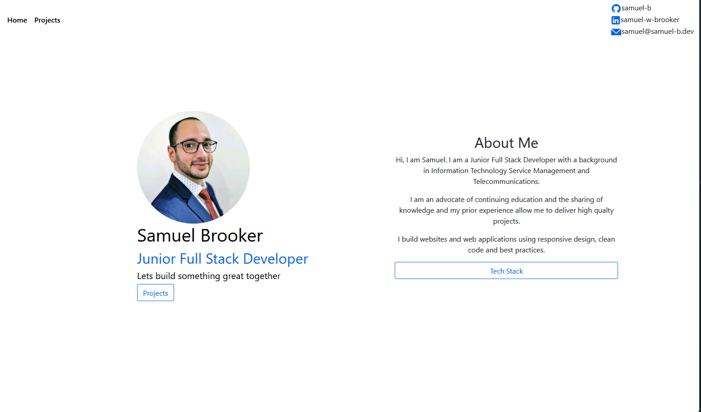
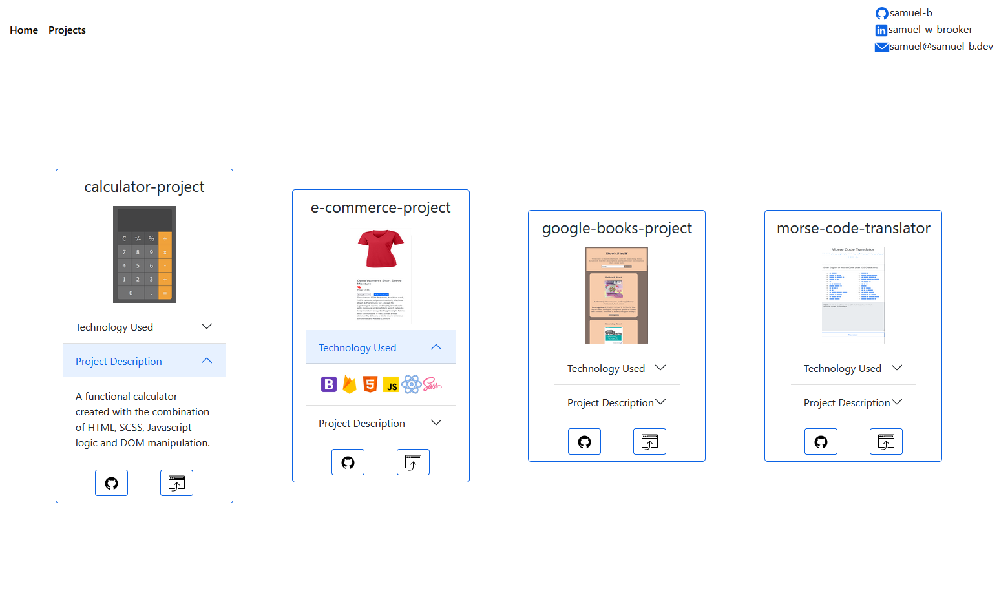

# personal-project-bs
https://samuel-b.dev/

# Screenshots

# Description
My responsive personal portfolio introducing me and my projects.

# Requirements

-   A landing page/section with a name and title on it.
-   An About page/section.
-   A Tech stacks/skills page/section.
-   A Project page/section - each project should have a little description,
    a link to a live version and a link to the matching GitHub Repo (using a README.md at the root of the repo)
-   A Contact page/section with email, GitHub profile link, LinkedIn profile link

# Implementation Details

## Technology

- React
- ReactQuery
- Bootstrap
- Styled Components
- HTML
- SCSS
- Javascript
- Git & Github
- Github REST API

## Design
A responsive clean two-page design that looks good any device, all project data is dynamically populated using data from the Github REST API

#### Limitations

1. Had difficulty deplying app to Github Pages as repositry was pointed to a custom domain

## Lifecycle

The project was originally built with HTML/SCSS and static data, since I have made the following major changes/improvements:
1. App is now build using React
2. Project data is dynamically populated using the ReactQuery library and Github REST API 
3. Contact details have been added to the end of the navbar
4. About Me/Tech Stack section been moved to the home page and is conditionally rendered on button click

In comparison to the original project:
1. Codebase is cleaner, less dense and more maintainable
2. Codebase will no longer need to grow in size as projects are dynamically populated
3. Reduced whitespace on website and overall more clean look and feel
# In The Future

### What I want to implement in the future

-  [ x ]  I want to implement more technologies e.g. A backend and/or building a frontend with React (from original version)
- [ ] Standardise components/theme/styled further with the Styled Components library
- [ ] Clean and refactor code further

### Lessons learned with this project

1. How to deploy a react app to Github Pages pointed to a custom domain
