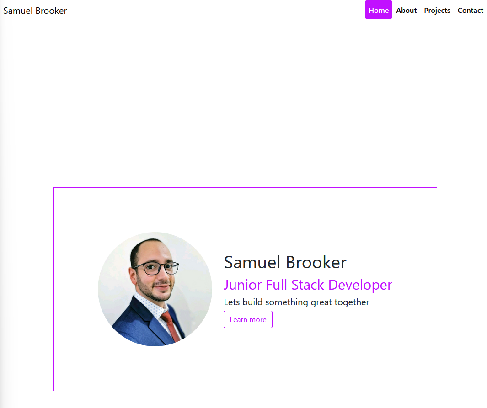
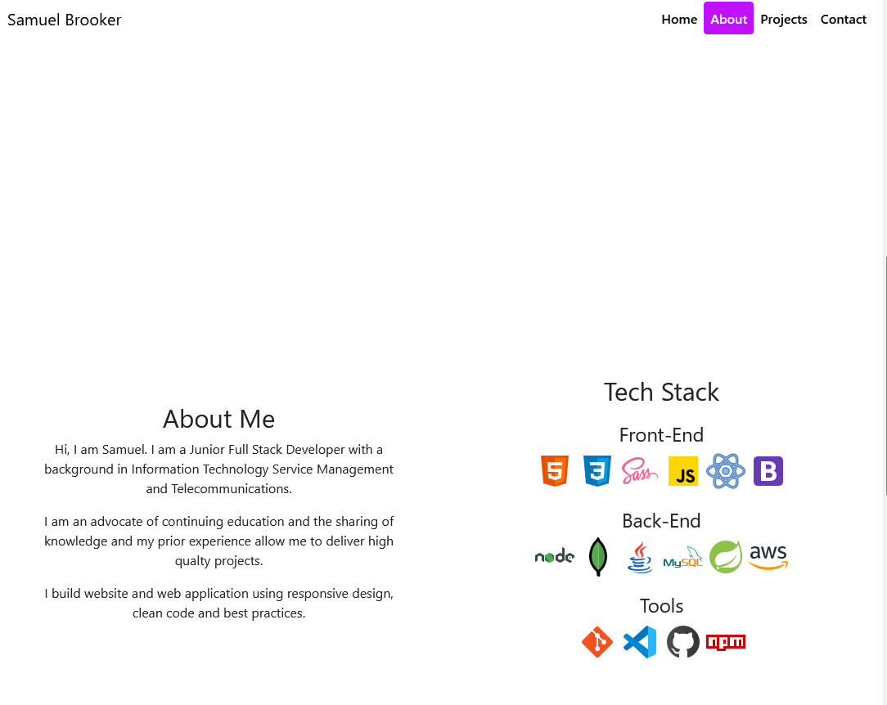
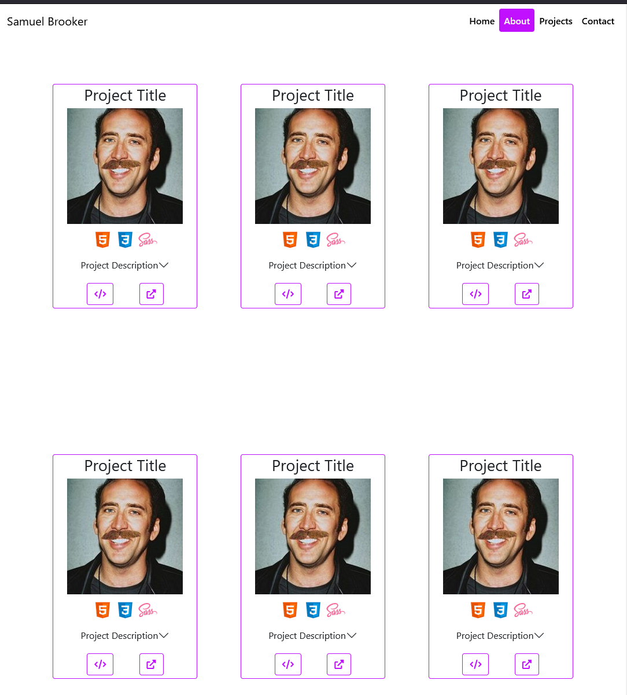
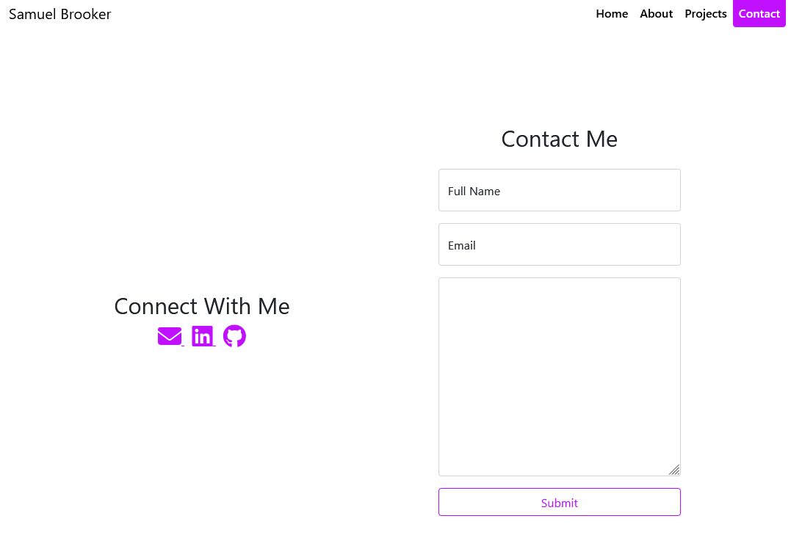

# personal-project-bs
https://samuel-b.github.io/personal-project-bs/

# Screenshots

# Description
My responsive personal portfolio built using HTML, SCSS/CSS, Bootstrap and a little javascript that introuces me and my projects.

# Requirements

-   A landing page/section with a name and title on it.
-   An About page/section.
-   A Tech stacks/skills page/section.
-   A Project page/section - each project should have a little description,
    a link to a live version and a link to the matching GitHub Repo (using a README.md at the root of the repo)
-   A Contact page/section with email, GitHub profile link, LinkedIn profile link

# Implementation Details

## Technology

-   HTML
-   SCSS
-   Bootstrap
-   Javascript
-   Git & Github

## Design

A single page design that is easily navigatable, responsive and looks good on any device with the implementation of SCSS/CSS and Bootstrap.

#### Limitations

1. Encountered a bug where the project cards were overlapping the next section, bug was caused by a specified height property that was assigned to the .section class and was only obvious when content was added to the next section. (refer to lessons learned at the end of the README)

## Lifecycle

Project was delivered a section or feature at a time on seperate branches and merged with the main branch after review.

# In The Future

### Where this project going in the future

   - The Project Page will be updated with more projects as they are developed.

### What I want to implement in the future

-   I want to implement more technologies e.g. A backend and/or building a frontend with React.

### Lessons learned with this project

1. To avoid the bug I encountered in the future I will be more concious of specified heigh properties and add placeholder text/content to all sections early so the bug will present itself and be resolved earlier on.
